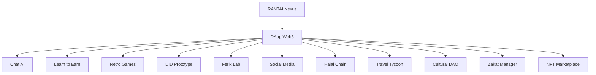

# RANTAI Nexus

RANTAI Nexus adalah ruang bermain sekaligus ruang belajar, di mana:

- Fun bertemu Focus

- Iman bertemu Inovasi

- Wisata bertemu Web3

- Akademik bertemu Eksperimen

Semua terhubung lewat rantai ide dan kode, serta kolaborasi dan aksi nyata.

---

# Modul DApp

Pilih modul dari navbar sesuai minatmu:

| Modul               | Deskripsi                                                                     |
| ------------------- | ----------------------------------------------------------------------------- |
| **Chat AI**         | Belajar dunia Web3 secara fun dan santai dengan AI multitalent.               |
| **Learn to Earn**   | Eksperimen musik bareng AI, lalu klaim hadiah lewat Web3.                     |
| **Retro Games**     | Mainkan 12 game klasik 8-bit dan koneksikan skor dengan pemain lain via Web3. |
| **DID Prototype**   | Prototype identitas digital terdesentralisasi, cikal bakal KTP masa depan.    |
| **Ferix Lab**       | Gambar mobil, adu kreasi, dan bandingkan karya lewat Web3.                    |
| **Social Media**    | Interaksi dan bangun jejaring sosial dengan dukungan Web3.                    |
| **Halal Chain**     | Analisis rantai pasok restoran untuk menilai status halal dengan Web3.        |
| **Travel Tycoon**   | Jadi pengusaha pariwisata dalam game simulasi berbasis Web3.                  |
| **Cultural DAO**    | Dukung dan voting budaya Indonesia melalui DAO.                               |
| **Zakat Manager**   | Kelola zakat lebih aman, transparan, dan nyaman menggunakan Web3.             |
| **NFT Marketplace** | Koleksi souvenir digital berupa NFT dari destinasi wisata Indonesia.          |

Vibes Nexus:
Bermain, belajar, berkreasi, dan berkolaborasi—all in one chain. 🚀

---

## Cara Akses Modul

1. Buka Nexus di browser:
https://rantai-nexus.streamlit.app

2. Login Web3 (wallet MetaMask atau sejenis).

3. Pilih modul dari navbar di atas sesuai minat.

4. Mulai eksplorasi: main, belajar, atau eksperimen.

5. Beberapa modul menyediakan reward / token untuk eksperimen & klaim hasil.

---

## Alur Nexus

